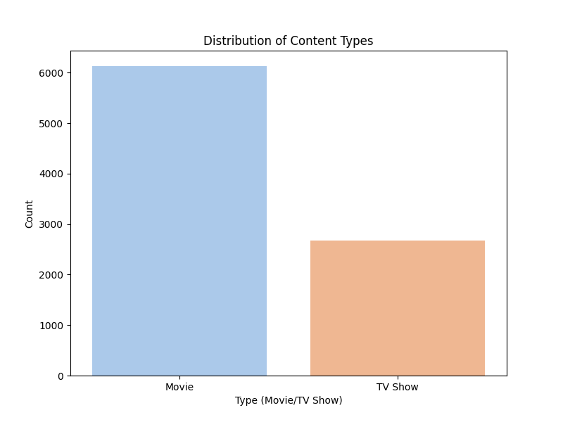
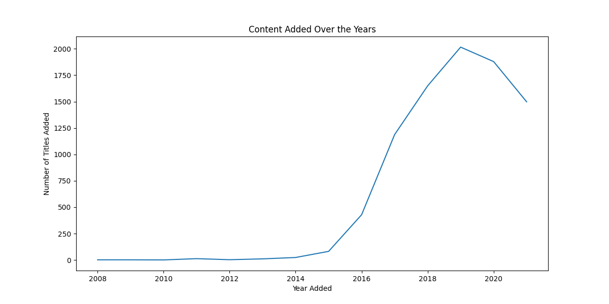
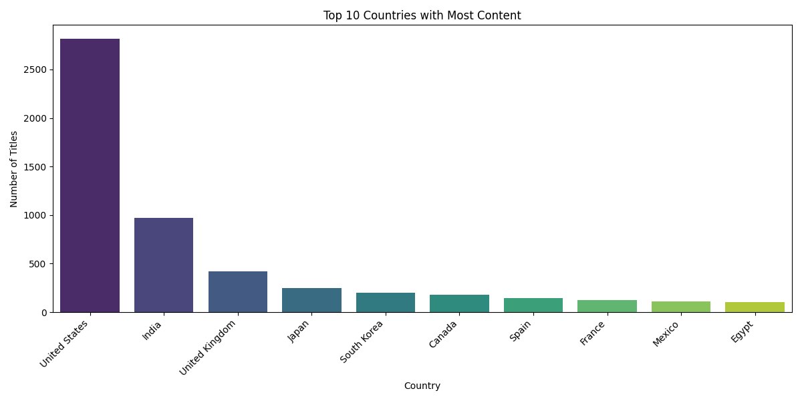

# Netflix Data Visualization

This project analyzes the Netflix dataset to uncover insights about the content available on the platform.

## Dataset

The dataset used in this project is the [Netflix Movies and TV Shows](https://www.kaggle.com/datasets/shivamb/netflix-shows) dataset from Kaggle. It contains information about TV shows and movies available on Netflix as of 2021.

## Visualizations

### Content Type Distribution

### Content Added Over the Years

### Top 10 Countries with Most Content

## Insights

Based on the visualizations, here are some insights:

*   **Content Type:** There are more movies than TV shows on Netflix.
*   **Content Growth:** The amount of content added to Netflix has been growing steadily over the years, with a significant increase in recent years.
*   **Top Countries:** The United States is the largest contributor of content to Netflix, followed by India and the United Kingdom.